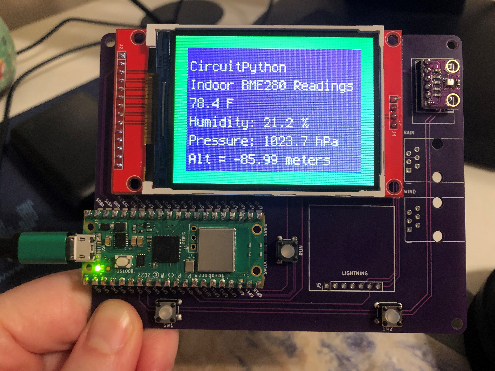

# hackerboxes-0087-circuit-python

## Description

Here is a simple CircuitPython script for HackerBoxes 0087

## Installation

You will need the following libraries in your lib folder after you have grabbed the most recent version of CircuitPython for your Pico.:
- adafruit_bme280
- adafruit_display_text
- adafruit_ili9341

## Photo

## Licence

MIT License

## Credits:

- This is all refactored Adafruit code.  Without them, nothing would be possible.  They are amazing.
